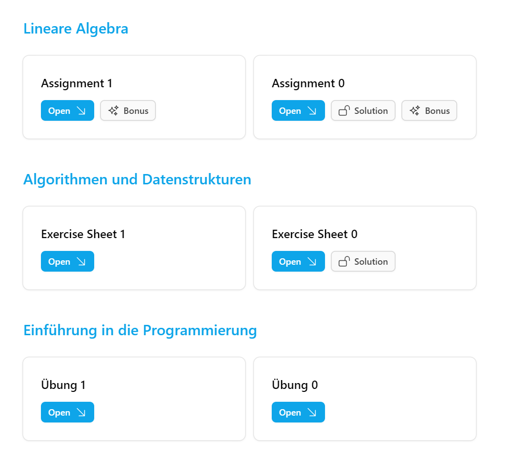

## Assignment Viewer

### Problem

During my first year at ETH Zürich, I encountered a challenge where I had to individually access and visit every lecture website to obtain the latest assignment or homework files. This required clicking an average of four links, which was three more than I desired.

### Solution

I have developed a website that consolidates various assignments, providing a centralized platform where you can access them, along with solutions and bonus questions.

### TODO's

- [ ] Don't hardcode the lectures, allow for dynamic selection / addition of lectures.
- [ ] Get rid of different parsing logic for each lecture website, maybe get GPT-3.5 to do the parsing for me.